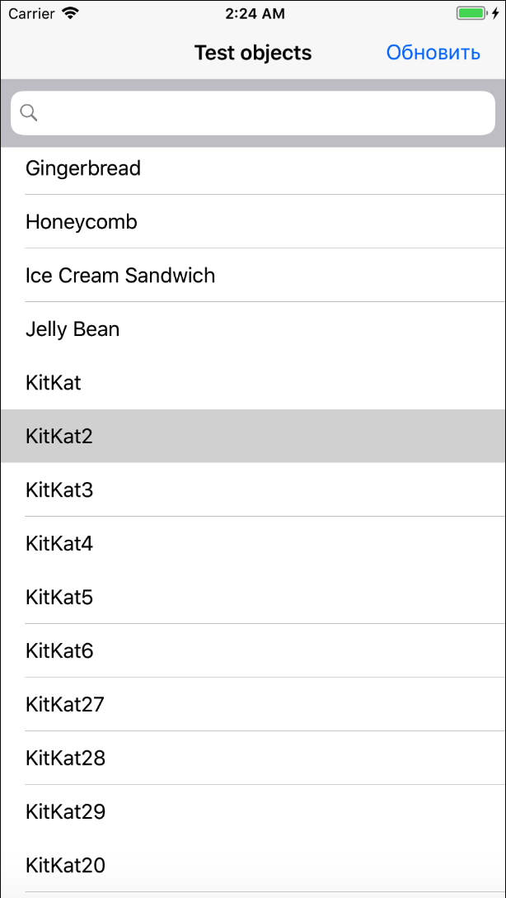

# SOKBNIITestAssignment
app implemented with MVP pattern, for app "as is" enough CocoaMVC, but quite often while app grows CocoaMVC becomes MassiveVC. During implementation, I tried to achieve max flexible (app's modules interact by protocols, dependency injection by setters and constructors) this makes app to be quite redundant but allows to add future functionality and testing in a more convenient way.

| Main screen  | Detail screen |
| ------------- | ------------- |
|   |   |
|Main screen in landscape mode | Detail screen in landscape mode|
|   |  |

